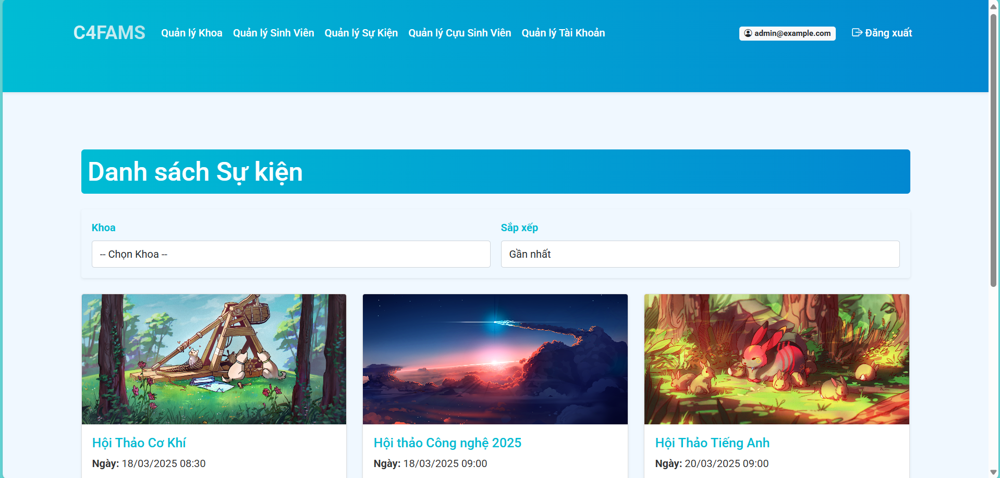

# C4FAMS - Code For Food Alumni Management System



## Giới thiệu
C4FAMS (Code For Food Alumni Management System) là một hệ thống quản lý cựu sinh viên được phát triển bằng ASP.NET Core 8.0, nhằm hỗ trợ các khoa và quản trị viên trong việc quản lý thông tin sinh viên, cựu sinh viên, sự kiện, và tài khoản người dùng. Dự án được thiết kế với giao diện hiện đại, dễ sử dụng, và tích hợp các tính năng phân quyền mạnh mẽ dựa trên vai trò người dùng (Admin, Khoa, CuuSinhVien).

Dự án được xây dựng để đáp ứng nhu cầu quản lý của các trường đại học, giúp kết nối giữa nhà trường và cựu sinh viên thông qua các sự kiện, đồng thời cung cấp công cụ để quản lý dữ liệu sinh viên và khoa một cách hiệu quả.

## Các tính năng chính
### 1. Quản lý Khoa
- **Admin**: Tạo, chỉnh sửa, xóa và xem chi tiết thông tin các khoa.
- **Khoa**: Xem thông tin chi tiết của khoa mà mình quản lý.

### 2. Quản lý Sinh viên
- **Admin và Khoa**:
  - Thêm, chỉnh sửa, xóa và xem chi tiết thông tin sinh viên.
  - Lọc sinh viên theo khoa, chuyên ngành, và khóa học.
  - Cập nhật trạng thái sinh viên (Còn học, Bảo lưu, Thôi học, Đã tốt nghiệp).
  - Giao diện: Bảng danh sách sinh viên với các nút hành động (Chi tiết, Sửa, Xóa, Cập nhật trạng thái).

### 3. Quản lý Cựu Sinh viên
- **Admin và Khoa**:
  - Quản lý danh sách cựu sinh viên (thêm, chỉnh sửa, xóa, xem chi tiết).
- **Cựu Sinh viên**:
  - Quản lý hồ sơ cá nhân (xem và cập nhật thông tin cá nhân).
  - Đăng ký tham gia các sự kiện do khoa tổ chức.

### 4. Quản lý Sự kiện
- **Admin và Khoa**:
  - Tạo, chỉnh sửa, xóa và xem chi tiết sự kiện.
  - Xem danh sách cựu sinh viên đã đăng ký tham gia sự kiện.
  - Lọc sự kiện theo khoa và sắp xếp theo thời gian (gần nhất/xa nhất).
- **Cựu Sinh viên**:
  - Xem danh sách sự kiện và đăng ký tham gia.
  - Xem các sự kiện đã đăng ký (My Events).

### 5. Quản lý Tài khoản
- **Admin**:
  - Quản lý tài khoản người dùng (tạo, chỉnh sửa, xóa, xem danh sách).
  - Phân quyền cho các tài khoản (Admin, Khoa, CuuSinhVien).
- **Tất cả người dùng**:
  - Đăng nhập, đăng ký tài khoản.
  - Quản lý tài khoản cá nhân (đổi mật khẩu, xem thông tin tài khoản).

### 6. Phân quyền
Sử dụng ASP.NET Core Identity để quản lý vai trò người dùng:
- **Admin**: Toàn quyền quản lý hệ thống.
- **Khoa**: Quản lý sinh viên, cựu sinh viên, và sự kiện thuộc khoa của mình.
- **CuuSinhVien**: Xem và đăng ký sự kiện, quản lý hồ sơ cá nhân.

### 7. Giao diện
- Sử dụng **Bootstrap 5** với gradient màu sắc hiện đại (#00BCD4 đến #0288D1).
- Bố cục rõ ràng, thân thiện với người dùng, hỗ trợ **responsive** trên các thiết bị.

## Công nghệ sử dụng
- **Backend**: ASP.NET Core 8.0
- **Database**: SQL Server (với Entity Framework Core)
- **Authentication/Authorization**: ASP.NET Core Identity
- **Frontend**:
  - Bootstrap 5
  - jQuery
  - Bootstrap Icons
  - Font: Google Fonts (Roboto)
- **IDE đề xuất**: Visual Studio 2022

## Yêu cầu cài đặt
### 1. Yêu cầu hệ thống
- .NET SDK: **8.0 hoặc cao hơn**
- SQL Server: **2019 hoặc cao hơn**
- Node.js (**tùy chọn**, để cài đặt các thư viện frontend nếu cần)

### 2. Các package cần thiết
Dự án sử dụng các package sau (được liệt kê trong file `.csproj`):
```xml
<PackageReference Include="Microsoft.AspNetCore.Identity.EntityFrameworkCore" Version="8.0.3" />
<PackageReference Include="Microsoft.AspNetCore.Identity.UI" Version="8.0.3" />
<PackageReference Include="Microsoft.EntityFrameworkCore" Version="8.0.3" />
<PackageReference Include="Microsoft.EntityFrameworkCore.Design" Version="8.0.3" />
<PackageReference Include="Microsoft.EntityFrameworkCore.SqlServer" Version="8.0.3" />
```

## Hướng dẫn cài đặt và chạy dự án
### 1. Clone dự án từ GitHub
```bash
git clone https://github.com/cuthanhcam/Advaned-Database-Project.git
cd Advaned-Database-Project
```

### 2. Cài đặt các package
```bash
dotnet restore
```

### 3. Cấu hình chuỗi kết nối database
Mở file `appsettings.json` và cập nhật chuỗi kết nối tới SQL Server của bạn:
```json
{
  "ConnectionStrings": {
    "DefaultConnection": "Server=your_server_name;Database=C4FAMS;Trusted_Connection=True;MultipleActiveResultSets=true"
  }
}
```

### 4. Cập nhật migrations và tạo database
```bash
dotnet ef migrations add InitialCreate
dotnet ef database update
```

### 5. Chạy dự án
```bash
dotnet run
```
Truy cập: `https://localhost:5001`

## Cấu trúc thư mục
```
Advaned-Database-Project/
├── Controllers/
├── Models/
├── Views/
├── wwwroot/
│   ├── css/
│   ├── js/
│   └── lib/
├── appsettings.json
├── Program.cs
└── Startup.cs
```

## Đóng góp
1. Fork dự án.
2. Tạo branch mới: `git checkout -b feature/your-feature-name`.
3. Commit thay đổi: `git commit -m "Thêm tính năng ..."`.
4. Push lên branch: `git push origin feature/your-feature-name`.
5. Tạo Pull Request trên GitHub.

## Liên hệ
- **Tác giả**: cuthanhcam
- **GitHub Issues**: Báo lỗi tại [đây](https://github.com/cuthanhcam/Advaned-Database-Project/issues).

## Giấy phép
Dự án được phát hành dưới **MIT License**.

## Lời cảm ơn
Dự án được phát triển bởi nhóm **Code For Food** với tất cả sự đam mê và yêu thương 💖. Cảm ơn bạn đã quan tâm đến **C4FAMS**!